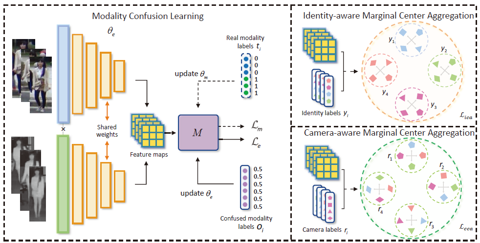

#  Cross-Modality Person Re-Identification via Modality Confusion and Center Aggregation (ICCV 2021)



### Highlight

Modality Confusion Learning Network (MCLNet) is designed to learn modality-invariant features by simultaneously minimizing inter-modality discrepancy while maximizing cross-modality similarity among instances in a single framework. MCLNet  aims to end-to-end learn the discrimination representations from two subspaces, modality properties and identity properties of the comprehensive feature space.

## ⚙️ Setup environment
* Clone this repo: 

  `git clone https://github.com/bitreidgroup/Modality-Confusion-Learning.git`

  `cd Modality-Confusion-Learning`

* Create a conda environment and activate the environment.
  
* `conda env create -f environment.yaml`  
  
  `conda activate mcl` 

*We recommend Python = 3.6, CUDA = 10.0, Cudnn = 7.6.5, Pytorch = 1.2, and CudaToolkit = 10.0.130 for the environment.* 

## 🔧 Preparing dataset

- **RegDB Dataset** :  The RegDB dataset can be downloaded from this [website](http://dm.dongguk.edu/link.html) by submitting a copyright form.

  (Named: "Dongguk Body-based Person Recognition Database (DBPerson-Recog-DB1)" on their website).

 *We do not preprocess the RegDB dataset.* 

- **SYSU-MM01 Dataset** :  The SYSU-MM01 dataset can be downloaded from this [website](http://isee.sysu.edu.cn/project/RGBIRReID.htm). 

- We preprocess the SYSU-MM01 dataset to speed up the training process.

  - if you do not need  the identities of the cameras, run the [preprocess scripts](https://github.com/mangye16/Cross-Modal-Re-ID-baseline/blob/master/pre_process_sysu.py)

    `python pre_process_sysu.py`  

  After running, the training data will be stored in ".npy" format.

  - if your need the identities of the cameras, run :

    `python pre_process_sysu_cam.py` 

  The identities of cameras will be also stored in ".npy" format.

### ⏳  Training

*You may need manually define the data path first.*

```shell
python train.py --dataset sysu --lr 0.1 --method mcl --gpu 1
```

 \- `--dataset`: which dataset "sysu" or "regdb".

\- `--lr`: initial learning rate.

  \- `--optim`: optimizer choice, SGD or Adam.

 \-  `--method`: method to run or baseline.

 \-  `--arch`: network baseline: ResNet18 or ResNet50

 \-  `--resume`: resume from checkpoint

 \-  `--model_path:` the path to save checkpoints 

 \- `--gpu`:  which gpu to run.

### 💽 Testing

```shell
python test.py --mode all --resume 'model_path' --gpu 1 --dataset sysu
```

 

 \- `--mode`: "all" or "indoor" all search or indoor search (only for SYSU-MM01 dataset).

 

 \- `--trial`: testing trial (only for RegDB dataset, no need for SYSU-MM01).

 

 \- `--resume`: the saved model path.

 


### 💾GPUs

All our experiments were performed on a single NVIDIA GeForce 2080 Ti

| Training Datasets | Approximate GPU memory | Approximate training time |
| ----------------- | ---------------------- | ------------------------- |
| SYSU-MM01         | 9GB                    | 24 hours                  |
| RegDB             | 6GB                    | 5 hours                   |


### Citation

If this repository helps your research, please cite :

```
@inproceedings{hao2021cross,
  title={Cross-modality person re-identification via modality confusion and center aggregation},
  author={Hao, Xin and Zhao, Sanyuan and Ye, Mang and Shen, Jianbing},
  booktitle={Proceedings of the IEEE/CVF International Conference on Computer Vision},
  pages={16403--16412},
  year={2021}
}
```

###  📄 References.

1. Ye, M., Shen, J., Lin, G., Xiang, T., Shao, L., & Hoi, S. C. (2021). Deep learning for person re-identification: A survey and outlook. *IEEE transactions on pattern analysis and machine intelligence*, *44*(6), 2872-2893.
2. Ye, M., Shen, J., J Crandall, D., Shao, L., & Luo, J. (2020, August). Dynamic dual-attentive aggregation learning for visible-infrared person re-identification. In *European Conference on Computer Vision* (pp. 229-247). Springer, Cham.

###  ✉️ Contact.

If you have some questions, feel free to contact me.
  yiyuanzhang.ai@gmail.com
